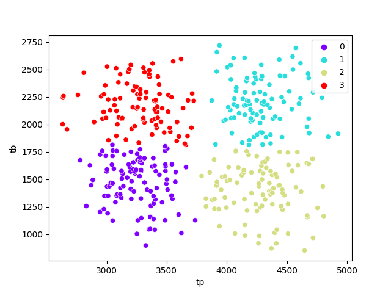

# Table of contents
1. [portcanto](#portcanto)
2. [Execució](#run)
3. [Docker](#docker)
5. [Testing](#tests)
6. [Pylint](#pylint)
7. [Llicència](#licence)

# portcanto <a name="portcanto"></a>
**portcanto** és un projecte de simulació de ciclistes que pugen i baixen el Port del Cantó, des de la banda de la Seu d'Urgell fins a Sort.
S'ha definit 4 patrons de ciclistes: BEBB (bons escaladors i bons baixadors); BEMB (bons escaladors i mal baixadors); MEBB (mal escaladors i bons baixadors); MEMB (mal escaladors i mal baixadors); 

Es creen dades sintètiques per poder fer un anàlisi de les dades amb IA (bàsicament un problema de clustering).

Consta de tres scripts:

- generardataset.py: crea a la carpeta data/ dades simulades. Es simulen 4 comportaments de ciclistes, que donaran lloc a 4 categories/clústers.
- clustersciclistes.py: S'aplica l'algorisme KMeans a les dades, i aflores els 4 clústers. D'entrada ja suposem que sortiran 4 clústers.
- mlflowtracking-K.py: script per a fer runs sobre un experiment de MLflow. És per comprovar que K=4 és la millor opció.

# Execució <a name="run"></a>

Pots crear un entorn virtual fent:
```
$ python -m venv venv
 o bé:
$ virtualenv venv

$ source venv/bin/activate
```

i tot seguit instal·lar els mòduls necessaris:
```
$ pip install -r requirements.txt
```

Per executar:
```
$ cd portcanto
$ python generardataset.py
$ python clustersciclistes.py
```

S'obtenen 4 clústers.




# Docker <a name="docker"></a>

```
Descarrega:
$ docker pull iabdioc/simparking:latest

Crea i arrenca el contenidor:
$ docker run --name simparking -dit iabdioc/portcanto:latest /bin/sh

Accedir al contenidor
$ docker exec -it portcanto /bin/bash
```

# Testing <a name="tests"></a>

Des de l'arrel del projecte:
```
$ python -m unittest discover -s tests
```
# Pylint <a name="pylint"></a>

Des de l'arrel del projecte:
```
$ pylint generardataset.py
$ pylint clustersciclistes.py
$ pylint mlflowtracking-K.py
```

# Llicència <a name="licence"></a>
Joan Quintana - IOC (2024)
Llicència MIT. [LICENSE.txt](LICENSE.txt) per més detalls

